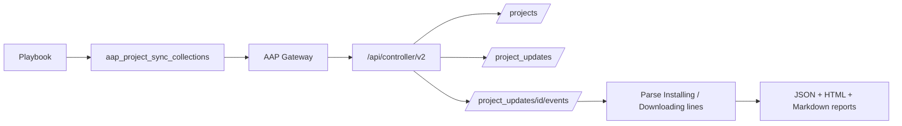

# demo-aap-project-sync-collections — Inspect collections from AAP project syncs

Shows which **Ansible collections** (and related download sources) were pulled when AAP **synced projects** — including versions resolved from `collections/requirements.yml` and their dependencies.

**Requires AAP 2.5+.** The module talks to **Platform Gateway** at `/api/controller/v2` (not the legacy controller-direct `/api/v2` path).

Galaxy install output is **not** in the top-level project-update stdout. It lives in `runner_on_ok` job **events** for the galaxy/collection install task. This demo’s module pages those events and parses the install lines.



## What you get

For each inspected project sync:

| Field | Source in galaxy stdout |
|-------|-------------------------|
| Collection FQCN + version | `Installing 'ns.name:1.2.3'…` |
| Download URL + host | `Downloading https://…/ns-name-1.2.3.tar.gz to …` |
| Git source | Detected via `Cloning into` / `Created collection for` → shown as **Git repo** (linked only if a `.git` URL also appears in the galaxy output) |
| Configured Galaxy server label | `'ns.name:1.2.3' obtained from server my_galaxy` (when present, often needs higher verbosity on the sync) |
| Dependency resolution | Presence of `Process install dependency map` |

A **summary** lists unique `ns.name:version` pairs and which projects used them — useful for “what Hub/Galaxy endpoints are we actually hitting?” and “which collections land via requirements + deps?”.

## Custom module

[`library/aap_project_sync_collections.py`](library/aap_project_sync_collections.py) calls Gateway `/api/controller/v2`.

| Option | Default | Description |
|--------|---------|-------------|
| `project_names` | `[]` | Empty = discover all projects; otherwise only these names |
| `organization` | — | Optional org filter when discovering |
| `since_hours` | `168` | Only updates created in this window; `0` = latest regardless of age |
| `updates_per_project` | `1` | How many recent successful syncs to inspect per project |
| `include_raw_stdout` | `false` | Attach concatenated galaxy event stdout to the JSON report |
| `aap_hostname` | env | Gateway URL (`AAP_HOSTNAME`; also accepts credential-injected `CONTROLLER_HOST`) |
| `aap_token` | env | Bearer token (`AAP_TOKEN` / `CONTROLLER_OAUTH_TOKEN`) |
| `aap_username` / `aap_password` | env | Basic auth alternative |
| `aap_validate_certs` | env / `true` | TLS verify (`AAP_VALIDATE_CERTS` / `CONTROLLER_VERIFY_SSL`) |

Auth on AAP: attach a **Red Hat Ansible Automation Platform** credential. It still injects `CONTROLLER_*` env vars; the module maps those onto the `aap_*` options.

## How to run (CLI)

```bash
cd demo-aap-project-sync-collections

# Extra vars (or env)
ansible-playbook playbook.yml -e @vars/my-lab.yml
# my-lab.yml can set:
#   aap_hostname: https://aap.example.com
#   aap_token: '...'

export AAP_HOSTNAME=https://aap.example.com
export AAP_TOKEN='your-token'
# or: AAP_USERNAME / AAP_PASSWORD

# All projects, last 7 days
ansible-playbook playbook.yml

# Named projects, latest sync of any age
ansible-playbook playbook.yml \
  -e 'project_names=["Lenny'\''s Ansible Playground","My Other Project"]' \
  -e since_hours=0

# Example vars file
cp vars/project_sync_collections.example.yml vars/project_sync_collections.yml
ansible-playbook playbook.yml -e @vars/project_sync_collections.yml
```

Artifacts (gitignored unless you commit an `*.example.*` sample):

- `project-sync-collections-report.json` — when `export_report_json=true`
- `project-sync-collections-report.html` — when `export_report_html=true` (email-friendly; linked project bullets)
- `project-sync-collections-report.md` — when `export_report_md=true` (GitHub-friendly)

If **all three** export flags are `false`, no files are written and the playbook prints a full multi-line **DEBUG** report in the job output instead.

## Ansible Automation Platform

After project sync, run **Playground | Apply CaC** to create **Demo | Project Sync Collections**.

| Survey / extra var | Purpose |
|--------------------|---------|
| `project_names_text` | Textarea: blank = all projects; otherwise one name per line (commas OK) |
| `organization` | Optional org name filter |
| `since_hours` | Integer lookback (`0` = latest any age) |
| `updates_per_project` | Integer, default `1` |
| `include_raw_stdout` | `true` / `false` |
| `export_report_json` | Write JSON artifact (default `true`) |
| `export_report_html` | Write HTML artifact (default `true`) |
| `export_report_md` | Write Markdown artifact (default `true`) |
| `report_dir` | Default `/tmp/project-sync-collections` on the EE |

Attach the playground **AAP Credential**. The job targets the localhost inventory.

## Notes and limits

- Only **successful** project updates are inspected by default.
- If a project has no `collections/requirements.yml` (or collections were already satisfied / skipped), the report may show no installs.
- Download URL hostnames reflect what ansible-galaxy logged (Galaxy, Automation Hub, private Hub, etc.).
- Distinguishing “explicitly listed in requirements” vs “pulled as a dependency” is not always available from stdout alone; when the dependency map ran, **all** listed installs for that sync came from that requirements-driven resolve.

## Layout

```text
demo-aap-project-sync-collections/
├── README.md
├── ansible.cfg                 # library = ./library
├── playbook.yml
├── playbook-aap.yml
├── library/
│   └── aap_project_sync_collections.py
├── templates/
│   ├── report.html.j2
│   ├── report.md.j2
│   └── report_console.txt.j2
└── vars/
    └── project_sync_collections.example.yml
```
