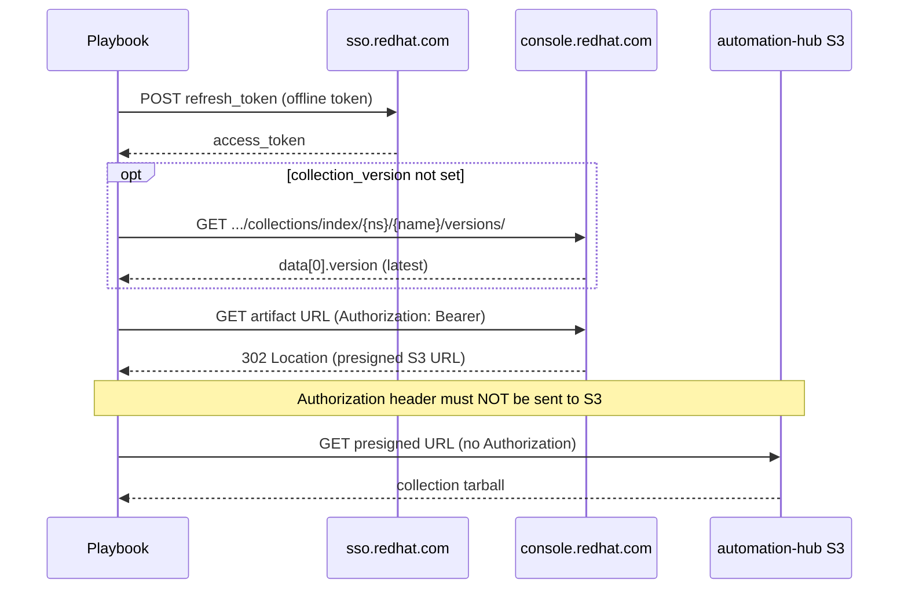

# demo-download-collection-tarball — Download a certified collection tarball from Automation Hub

Demonstrates downloading an **Ansible collection `.tar.gz` artifact** from [Red Hat Automation Hub](https://console.redhat.com/ansible/automation-hub) using the public API — without `ansible-galaxy collection install`. Useful when you need the raw tarball for air-gapped transfer, custom pipelines, or inspection.

The playbook:

1. Exchanges a **Red Hat offline token** (refresh token) for a short-lived access token via SSO.
2. When `collection_version` is omitted, queries the Hub **versions index** and picks the latest published version.
3. Requests the collection artifact URL from Automation Hub (authenticated).
4. Follows the **302 redirect** to a presigned S3 URL and saves the tarball locally.



## Key variables

| Variable | Required | Default | Description |
|----------|----------|---------|-------------|
| `redhat_offline_token` | Yes | `.offline_token` file, else `REDHAT_OFFLINE_TOKEN` env | Red Hat **offline token** (refresh token) — create at [access.redhat.com/management/api](https://access.redhat.com/management/api) |
| `collection_namespace` | Yes | — | Collection namespace (e.g. `ansible`, `redhat`) |
| `collection_name` | Yes | — | Collection name (e.g. `eda`, `satellite`) |
| `collection_version` | No | latest from Hub | Exact version string; omit to download the newest published version |
| `download_dir` | No | `{{ playbook_dir }}/downloads` | Local directory on the controller / execution node |

The artifact filename is always `{{ collection_namespace }}-{{ collection_name }}-{{ collection_version }}.tar.gz`.

Browse collections and versions on Automation Hub: [console.redhat.com/ansible/automation-hub](https://console.redhat.com/ansible/automation-hub).

### Latest version lookup

When `collection_version` is not set (or is an empty string), the playbook calls:

```bash
curl -s -H "Authorization: Bearer $ACCESS_TOKEN" \
  "https://console.redhat.com/api/automation-hub/v3/plugin/ansible/content/published/collections/index/{namespace}/{name}/versions/"
```

Hub returns versions newest-first; the playbook uses `data[0].version` (same as piping the response through `jq '.data[0].version'`).

## Prerequisites

1. A valid **Red Hat offline token** for API access. Generate one from the [Red Hat API Tokens](https://access.redhat.com/management/api) page (log in with your Red Hat account, create an offline token). The playbook exchanges this refresh token with `rhsm-api` on `sso.redhat.com` for a short-lived access token.
2. Ansible **2.12+** on the controller (`unredirected_headers` on `get_url` is required for the S3 redirect).
3. Outbound HTTPS to `sso.redhat.com` and `console.redhat.com`.

## How to run (CLI)

### 1. Provide the offline token

Create an offline token at [access.redhat.com/management/api](https://access.redhat.com/management/api), then provide it to the playbook one of these ways:

**Option A — file (local demo):**

```bash
# One line, no trailing newline required
echo 'YOUR_OFFLINE_TOKEN' > .offline_token
```

The file is gitignored (see [`.gitignore`](.gitignore)).

**Option B — environment variable:**

```bash
export REDHAT_OFFLINE_TOKEN='YOUR_OFFLINE_TOKEN'
```

[`playbook.yml`](playbook.yml) reads `.offline_token` first, then falls back to the environment variable.

### 2. Download a specific version

```bash
ansible-playbook playbook.yml \
  -e collection_namespace=ansible \
  -e collection_name=eda \
  -e collection_version=2.12.1
```

The tarball is written to `downloads/ansible-eda-2.12.1.tar.gz`.

### 3. Download the latest published version

Omit `collection_version`:

```bash
ansible-playbook playbook.yml \
  -e collection_namespace=ansible \
  -e collection_name=eda
```

### 4. More extra var examples

```bash
ansible-playbook playbook.yml \
  -e collection_namespace=redhat \
  -e collection_name=satellite \
  -e collection_version=5.0.0
```

```bash
ansible-playbook playbook.yml \
  -e collection_namespace=ansible \
  -e collection_name=controller \
  -e collection_version=4.7.0 \
  -e download_dir=/var/tmp/my-collections
```

Extra vars are the same names the AAP Survey uses (see below).

## Why `unredirected_headers`?

Automation Hub responds with **HTTP 302** to a presigned S3 URL. If `get_url` forwards `Authorization: Bearer …` to S3, the request fails with **HTTP 400**. Setting `unredirected_headers: [Authorization]` sends the token only to Hub, not to S3 — matching `curl -L` behavior.

## Ansible Automation Platform

[`playbook-aap.yml`](playbook-aap.yml) imports [`playbook.yml`](playbook.yml) — same tasks, survey-driven extra vars.

### Job template setup

| Setting | Value |
|---------|--------|
| Playbook | `demo-download-collection-tarball/playbook-aap.yml` |
| Inventory | `localhost` or a single-host inventory |
| Execution environment | Default ansible-core EE (2.12+) |
| Privilege escalation | Off |
| Fact gathering | Off (play sets `gather_facts: false`) |

### Credential — offline token (recommended)

Do **not** put the offline token in a Survey question (surveys are visible to job operators). Inject it via a **credential** instead. Create the token value at [access.redhat.com/management/api](https://access.redhat.com/management/api).

**Custom credential type** (minimal example):

| Input field | Variable name | Secret |
|-------------|---------------|--------|
| Red Hat Offline Token | `redhat_offline_token` | Yes |

Attach that credential to the job template. AAP injects `redhat_offline_token` as an extra var at runtime.

**Alternative:** configure `REDHAT_OFFLINE_TOKEN` on the execution environment or job template extra vars (less ideal for rotation, but works with the playbook’s env lookup fallback).

### Survey — collection to download

Enable **Survey** on the job template and add:

| Question | Variable | Type | Required | Default | Notes |
|----------|----------|------|----------|---------|-------|
| Collection namespace | `collection_namespace` | Text | Yes | — | e.g. `ansible`, `redhat` |
| Collection name | `collection_name` | Text | Yes | — | e.g. `eda`, `satellite` |
| Collection version | `collection_version` | Text | No | — | Leave blank for latest from Hub |
| Download directory | `download_dir` | Text | No | — | e.g. `/tmp/collection-downloads`; defaults to `playbook_dir/downloads` if omitted |

Example survey answers for latest `ansible.eda`:

| Question | Answer |
|----------|--------|
| Collection namespace | `ansible` |
| Collection name | `eda` |
| Collection version | *(leave blank)* |
| Download directory | `/tmp/collection-downloads` |

Example for a pinned `redhat.satellite` 5.0.0:

| Question | Answer |
|----------|--------|
| Collection namespace | `redhat` |
| Collection name | `satellite` |
| Collection version | `5.0.0` |
| Download directory | `/tmp/collection-downloads` |

### Survey JSON (import-friendly reference)

```json
{
  "name": "Collection download",
  "description": "Target collection for Automation Hub artifact download",
  "spec": [
    {
      "variable": "collection_namespace",
      "question_name": "Collection namespace",
      "type": "text",
      "required": true
    },
    {
      "variable": "collection_name",
      "question_name": "Collection name",
      "type": "text",
      "required": true
    },
    {
      "variable": "collection_version",
      "question_name": "Collection version (blank = latest)",
      "type": "text",
      "required": false
    },
    {
      "variable": "download_dir",
      "question_name": "Download directory",
      "type": "text",
      "required": false
    }
  ]
}
```

### Extra vars without Survey

```yaml
collection_namespace: ansible
collection_name: eda
# collection_version omitted → latest from Hub
download_dir: /tmp/collection-downloads
```

Survey answers and job-template extra vars merge the same way as any other AAP job.

### Retrieving the tarball after the job

The file lands on the **execution node** filesystem (`download_dir`). For a one-off download:

- Use a known path under `/tmp` and copy from the container/host if you have access, or
- Follow this job with a template that archives/uploads the artifact (S3, artifact store, etc.) — out of scope for this demo.

## Layout

```text
demo-download-collection-tarball/
├── README.md
├── playbook.yml          # CLI + shared logic
├── playbook-aap.yml      # imports playbook.yml for AAP job templates
├── .gitignore            # .offline_token, downloads/
└── downloads/            # created at runtime (CLI default download_dir)
```

## Things to try

- Omit `collection_version` and confirm the playbook picks the newest Hub version.
- Pin an older version with `-e collection_version=2.10.0` and compare tarball names.
- Run without `collection_namespace` / `collection_name` and confirm the assert fails early.
- Run twice — second run should report `ok` (unchanged) unless you delete the file.
- Temporarily remove `unredirected_headers` and reproduce the HTTP 400 against S3.

## References

- [Getting started with automation hub](https://docs.redhat.com/en/documentation/red_hat_ansible_automation_platform/latest/html/getting_started_with_automation_hub/index)
- [ansible.builtin.get_url — unredirected_headers](https://docs.ansible.com/ansible/latest/collections/ansible/builtin/get_url_module.html)
- [Importing/exporting collections in automation hubs (API curl pattern)](https://www.redhat.com/en/blog/importing/exporting-collections-in-automation-hubs)
