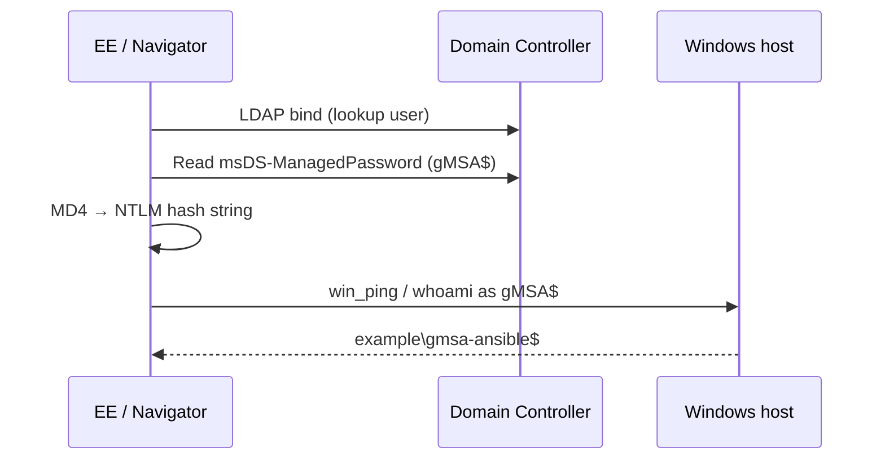

# demo-gmsa-winrm — Authenticate to Windows over WinRM as a gMSA

Shows how a **Linux execution environment** can connect to a Windows host using a **Group Managed Service Account (gMSA)** — an identity with no human-known password. The playbook retrieves `msDS-ManagedPassword` from Active Directory, derives an NTLM credential, and runs `win_ping` / `whoami` as the gMSA.

> **Do not run these playbooks with `ansible-playbook` on your Linux workstation.** They template `/etc/krb5.conf` inside the EE container. Use **`ansible-navigator`** or **AAP** only.

> **No lab yet?** Start with **[lab-setup/README.md](lab-setup/README.md)** — one Windows Server VM, one PowerShell script, then build the EE and run.

## Why this demo exists

Ansible WinRM expects `ansible_user` + `ansible_password`. A gMSA password lives only in AD (`msDS-ManagedPassword`) and rotates automatically. This demo closes that gap using a small Python helper based on [Jordan Borean's gMSA kinit prototype](https://gist.github.com/jborean93/7634153074c223cc792ddd04c665db47) (pywinrm / ansible.windows maintainer).



## Choosing a playbook

| Playbook | Purpose |
|----------|---------|
| [`playbook-simple.yml`](playbook-simple.yml) | **Minimal** — LDAP fetch → `win_ping` → `whoami`. Best first run. |
| [`playbook.yml`](playbook.yml) | **Full demo** — same flow + summary report file. |
| [`playbook-aap.yml`](playbook-aap.yml) | AAP job template entry point (survey + Machine credential for lookup user). |

## Prerequisites

| Layer | Requirement |
|-------|-------------|
| Active Directory | Domain with a gMSA and a lookup principal in `PrincipalsAllowedToRetrieveManagedPassword` |
| Windows target | WinRM reachable (demo lab uses HTTP **5985**) |
| gMSA on target | Member of `Remote Management Users` (or equivalent WinRM access) |
| Linux runner | `podman`, `ansible-builder`, `ansible-navigator` |
| EE image | `demo-gmsa-winrm-ee:latest` (includes `ldap3`) |

Use **[lab-setup/Configure-GmsaLab.ps1](lab-setup/Configure-GmsaLab.ps1)** to create all AD objects from a fresh Windows Server VM.

## Layout

| Path | Purpose |
|------|---------|
| [`playbook-simple.yml`](playbook-simple.yml) | Minimal walkthrough |
| [`playbook.yml`](playbook.yml) | Full demo + report |
| [`playbook-aap.yml`](playbook-aap.yml) | AAP job template |
| [`roles/gmsa_winrm/`](roles/gmsa_winrm/) | krb5.conf deploy, LDAP fetch, credential facts |
| [`roles/gmsa_winrm/files/fetch_gmsa_password.py`](roles/gmsa_winrm/files/fetch_gmsa_password.py) | AD password retrieval + NT hash derivation |
| [`vars/gmsa.example.yml`](vars/gmsa.example.yml) | Lab vars (copy → `vars/gmsa.yml`, gitignored) |
| [`inventories/hosts.example.yml`](inventories/hosts.example.yml) | Sample Windows inventory |
| [`inventories/group_vars/windows.yml`](inventories/group_vars/windows.yml) | WinRM defaults for group `windows` |
| [`execution-environment.yml`](execution-environment.yml) | EE definition (`ldap3`, `ansible.windows`) |
| [`lab-setup/`](lab-setup/) | AD lab bootstrap from scratch |

## Quick start (after lab-setup)

```bash
cd demo-gmsa-winrm
cp vars/gmsa.example.yml vars/gmsa.yml
cp inventories/hosts.example.yml inventories/hosts.yml
# edit vars/gmsa.yml and inventories/hosts.yml

podman login registry.redhat.io
ansible-builder build -f execution-environment.yml -t localhost/demo-gmsa-winrm-ee:latest

ansible-navigator run playbook-simple.yml -e @vars/gmsa.yml
```

## How authentication works

1. **Lookup account** (`gmsa_ldap_lookup_user`) binds to LDAP. It must be listed on the gMSA's `PrincipalsAllowedToRetrieveManagedPassword` (directly or via a group).
2. Script reads the binary `msDS-ManagedPassword` blob and parses `current_password` (UTF-16 bytes).
3. **NTLM path** (default): `MD4(password_bytes)` → pywinrm hash form `00000000000000000000000000000000:<NT_HASH>`.
4. Playbook sets `ansible_user` to `gmsa-ansible$@EXAMPLE.COM` and `ansible_winrm_transport: ntlm`.
5. `win_ping` / `win_shell` run as the gMSA.

Kerberos with gMSA from Linux is possible but has encoding edge cases; the gist author validated **NTLM + NT hash** first. Hardened domains with RC4 disabled need AES key derivation (out of scope for this introductory demo).

## Key variables

| Variable | Default | Description |
|----------|---------|-------------|
| `gmsa_realm` | `EXAMPLE.COM` | Realm / UPN suffix |
| `gmsa_domain` | `example.com` | DNS domain for krb5.conf |
| `gmsa_ldap_server` | — | DC hostname for LDAP |
| `gmsa_ldap_search_base` | — | e.g. `DC=example,DC=com` |
| `gmsa_ldap_lookup_user` | — | Domain user allowed to read gMSA password |
| `gmsa_ldap_lookup_password` | — | Lookup user password |
| `gmsa_sam_account_name` | `gmsa-ansible` | gMSA name **without** `$` |
| `gmsa_winrm_transport` | `ntlm` | WinRM auth after hash derivation |
| `gmsa_skip_win_ping` | `false` | LDAP-only test (no Windows host needed) |
| `gmsa_ldap_bind_type` | `ntlm` | LDAP bind style (`ntlm` or `simple`) |
| `gmsa_ldap_start_tls` | `false` | Upgrade plain LDAP with StartTLS |

## Ansible Automation Platform

| Field | Value |
|-------|-------|
| Playbook | `playbook-aap.yml` |
| Inventory | Hosts in group `windows` |
| EE | `demo-gmsa-winrm-ee:latest` |
| Credential | **Machine** — lookup user (`svc-gmsa-lookup`) + password (injected as `ansible_user` / `ansible_password`, mapped to LDAP vars) |

Survey questions (see `aap-playground-setup/vars/job_templates.yml`): realm, domain, LDAP server, search base, gMSA SAM name, lookup username, skip win_ping.

The Machine credential supplies the **lookup** account, not the gMSA. The playbook fetches the gMSA password at runtime.

## Things to try

- Run `playbook-simple.yml` and confirm `whoami` shows `example\gmsa-ansible$`.
- Set `gmsa_skip_win_ping: true` to validate LDAP retrieval only.
- Compare with [`demo-kerberos-winrm`](../demo-kerberos-winrm/README.md) (regular user + Kerberos tickets).
- Add a second Windows host — LDAP fetch runs once (`run_once`); `win_ping` runs per host.

## Limitations

- **Prototype pattern** — not a supported Ansible core feature; maintain the helper script with your AD policies.
- **NTLM / RC4** — simplest lab path; may not work when the domain disables RC4.
- **Least privilege** — `msDS-ManagedPassword` read access is powerful; use dedicated lookup principals.
- **Attribution** — `MSDSManagedPassword` parsing derived from [jborean93's gist](https://gist.github.com/jborean93/7634153074c223cc792ddd04c665db47) (MIT).

## Related demos

- [`demo-kerberos-winrm`](../demo-kerberos-winrm/README.md) — Kerberos ticket visibility with standard domain users
- [`demo-winrm-vs-psrp`](../demo-winrm-vs-psrp/README.md) — WinRM vs PSRP timing
