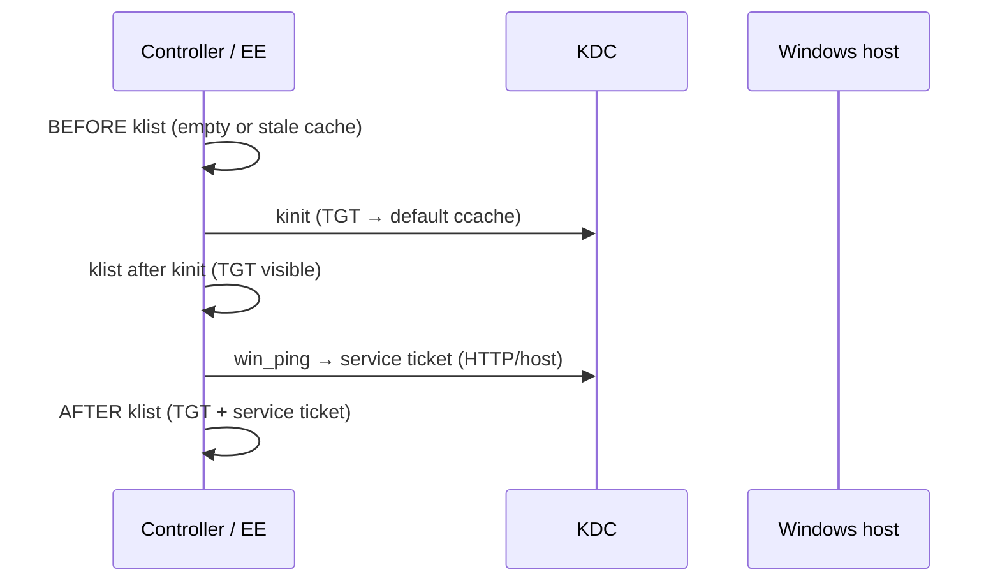

# demo-kerberos-winrm — Kerberos tickets when connecting to Windows over WinRM

Shows what happens **inside an execution environment** (Navigator container or AAP job pod) when Ansible reaches a Windows host over WinRM with Kerberos. One-off diagnostics run once at the start; repeatable `klist` snapshots capture ticket-cache state **before** and **after** `win_ping`.

> **Do not run these playbooks with `ansible-playbook` on your Linux workstation.** They template `/etc/krb5.conf` and run `kinit` on the machine executing the tasks — without an EE, that overwrites **your host's** Kerberos configuration. Use **`ansible-navigator`** or **AAP** only.

## Choosing a playbook

| Playbook | Purpose |
|----------|---------|
| [`playbook-simple.yml`](playbook-simple.yml) | **Minimal walkthrough** — `klist` → `kinit` → `klist` → `win_ping` → `klist` with `debug` after each step. Best for teaching. Navigator only. |
| [`playbook.yml`](playbook.yml) | **Full demo** — EE diagnostics (DNS, KDC, krb5.conf), BEFORE/AFTER snapshots, formatted `kerberos-diag-report.txt`. Run via Navigator or AAP. |
| [`playbook-aap.yml`](playbook-aap.yml) | Same as `playbook.yml`, structured for AAP job templates (survey + Machine credential). |

## Why manual kinit is the default here

To make tickets **visible to `klist` in separate shell tasks**, you need **both**:

1. **`ansible_winrm_kinit_mode: manual`** — tells WinRM *not* to run its own ephemeral kinit
2. **An explicit `kinit`** — puts the TGT into the **default credential cache** that `klist` reads

With Ansible's production default (`managed` mode), WinRM kinits into a **temporary** `KRB5CCNAME` before each task and **deletes it when the task finishes**. A `klist` in a separate shell task never sees those tickets — that is expected, not a bug.

This demo defaults to **manual + role-driven `kinit`** so BEFORE/AFTER snapshots actually show ticket state.



### Managed mode (opt-in for comparison)

Set `ansible_winrm_kinit_mode: managed` in `inventories/group_vars/windows.yml` and `kerberos_run_kinit: false`. WinRM handles kinit internally; `klist` snapshots will **not** reflect WinRM auth. Use `-vvv` to observe temp cache creation/deletion instead.

## What the full demo shows (`playbook.yml`)

| Phase | Role vars | Checks |
|-------|-----------|--------|
| One-off (start) | `kerberos_diag_run_one_off: true` | Container UTC time, `krb5.conf`, Kerberos env vars, `dig` SRV records, KDC TCP port 88 |
| BEFORE | `kerberos_diag_label: BEFORE` | Env vars, `KRB5CCNAME` / ccache listing, `klist -e -f -a` |
| kinit | `kerberos_diag_run_kinit: true` | `kinit` + immediate `klist` (logged) |
| WinRM | — | `ansible.windows.win_ping` — uses default ccache, acquires service ticket |
| AFTER | `kerberos_diag_label: AFTER` | Same snapshot tasks as BEFORE |
| Report | `kerberos_diag_display_log: true` | Formatted `kerberos-diag-report.txt` on the controller |

All diagnostic tasks run via the `kerberos_diagnostics` role with **`delegate_to: localhost`** and **`run_once: true`** so diagnostics execute once per play even when the inventory contains multiple Windows hosts.

## Layout

| Path | Purpose |
|------|---------|
| [`playbook-simple.yml`](playbook-simple.yml) | Minimal klist / kinit / win_ping walkthrough |
| [`playbook.yml`](playbook.yml) | Navigator — full diagnostics |
| [`playbook-aap.yml`](playbook-aap.yml) | AAP job template — full diagnostics |
| [`roles/kerberos_diagnostics/`](roles/kerberos_diagnostics/) | Diagnostic + kinit tasks + report formatter |
| [`roles/kerberos_diagnostics/files/format_kerberos_report.py`](roles/kerberos_diagnostics/files/format_kerberos_report.py) | Formats raw EE log → readable report |
| [`vars/kerberos.example.yml`](vars/kerberos.example.yml) | Local lab vars (copy → `vars/kerberos.yml`, gitignored) |
| [`inventories/group_vars/windows.yml`](inventories/group_vars/windows.yml) | WinRM + Kerberos connection defaults for group `windows` |
| [`inventories/hosts.example.yml`](inventories/hosts.example.yml) | Sample Windows inventory |
| [`execution-environment.yml`](execution-environment.yml) | EE definition (`ee-minimal-rhel9:2.16` + dig + ansible.windows) |
| [`ansible-navigator.yml`](ansible-navigator.yml) | Navigator defaults (`mode: stdout`, EE image, inventory, `ansible.cfg`) |
| [`ansible.cfg`](ansible.cfg) | Default inventory + `result_format = yaml` for readable output |
| `kerberos-diag-report.txt` | Generated report (gitignored; written each full demo run) |

## krb5.conf: build into the EE, or deploy at runtime?

Use **both**, for different jobs:

| Layer | What belongs there | When it changes |
|-------|-------------------|-----------------|
| **EE image** | `krb5-workstation`, `bind-utils`, `pywinrm[kerberos]`, stub `/etc/krb5.conf` | Python/system dependency updates |
| **Role template** | Realm, KDC list, `domain_realm` mapping | Every lab / customer / realm change |

**Do not bake realm-specific `krb5.conf` into the EE.** The role templates it from extra vars when `kerberos_deploy_krb5_conf: true` (default). Runtime deployment targets `/etc/krb5.conf` **inside the EE container** — which is why this demo must not be run with bare `ansible-playbook` on your workstation.

## Common setup

```bash
cd demo-kerberos-winrm
cp vars/kerberos.example.yml vars/kerberos.yml
cp inventories/hosts.example.yml inventories/hosts.yml
# edit vars/kerberos.yml (realm, domain, credentials)
# edit inventories/hosts.yml (Windows hostname)
```

`ansible_user` must be **UPN form** (`svc-ansible@EXAMPLE.COM`) for Kerberos WinRM. Set it in `vars/kerberos.yml` or per-host in `inventories/hosts.yml`.

For **Navigator**, pass the local vars file with `-e @vars/kerberos.yml` — one gitignored file for realm settings, demo flags, and credentials.

### SPN troubleshooting

If `win_ping` fails with **"Server not found in Kerberos database"**, the `HTTP/<hostname>` SPN is missing or mismatched. Check on Windows with `setspn -L <computername>` and set `ansible_winrm_kerberos_hostname_override` on the host if needed (see [`inventories/hosts.example.yml`](inventories/hosts.example.yml)).

---

## How to run

Two supported paths — both execute inside an EE (container or AAP job pod), never directly on your workstation.

### 1. `ansible-navigator` (local EE)

Runs the playbook inside the custom execution environment — closest match to how AAP executes jobs, and **isolates** `/etc/krb5.conf` changes to the container.

**Build the EE** (once per dependency change):

```bash
cd demo-kerberos-winrm
podman login registry.redhat.io
ansible-builder build -f execution-environment.yml -t localhost/demo-kerberos-winrm-ee:latest
```

Base image: `registry.redhat.io/ansible-automation-platform-27/ee-minimal-rhel9:2.16`

`ee-minimal-rhel9` uses **microdnf**; `execution-environment.yml` sets `options.package_manager_path: /usr/bin/microdnf`.

**Configure and run** (reads [`ansible-navigator.yml`](ansible-navigator.yml); cmdline includes `-e @vars/kerberos.yml`):

```bash
cp vars/kerberos.example.yml vars/kerberos.yml   # first time only
cp inventories/hosts.example.yml inventories/hosts.yml
# edit vars/kerberos.yml and inventories/hosts.yml for your lab

# Simple walkthrough
ansible-navigator run playbook-simple.yml -e @vars/kerberos.yml

# Full demo
ansible-navigator run playbook.yml -e @vars/kerberos.yml

# Interactive TUI (override default stdout mode)
ansible-navigator run playbook.yml -e @vars/kerberos.yml --mode interactive
```

Navigator settings in `ansible-navigator.yml`:

| Setting | Value |
|---------|-------|
| Mode | `stdout` (terminal output; use `--mode interactive` for TUI) |
| EE image | `localhost/demo-kerberos-winrm-ee:latest` |
| Inventory | `inventories/hosts.yml` |
| Ansible config | `ansible.cfg` |
| Playbook + vars | `playbook.yml -e @vars/kerberos.yml` |

Push to a registry if Navigator or AAP runs on another host:

```bash
podman tag localhost/demo-kerberos-winrm-ee:latest registry.example.com/demo-kerberos-winrm-ee:latest
podman push registry.example.com/demo-kerberos-winrm-ee:latest
```

> **Note:** `vars/kerberos.yml` and `inventories/hosts.yml` are gitignored. Copy from the `.example` files.

---

### 2. Ansible Automation Platform (Survey + Credentials)

Use [`playbook-aap.yml`](playbook-aap.yml) on a job template. AAP supplies inventory, credentials, and survey answers as extra vars; the playbook does **not** use `vars_files` (no `kerberos.yml` required in the project).

#### Project

Sync this repo (or `demo-kerberos-winrm/` subtree) into an AAP project.

#### Execution environment

Assign the built image (`demo-kerberos-winrm-ee:latest`) to the job template. The image must include `klist`, `kinit`, `dig`, `pywinrm[kerberos]`, and `ansible.windows`.

#### Inventory

Hosts must be in group **`windows`**. Example host vars (can also come from the credential):

```yaml
ansible_host: win2019.example.com
ansible_connection: winrm
ansible_port: 5985
ansible_winrm_transport: kerberos
ansible_winrm_kinit_mode: manual
```

`playbook-aap.yml` also sets `ansible_winrm_kinit_mode: manual` at the play level.

#### Credentials

| Credential type | Fields | Notes |
|-----------------|--------|-------|
| **Machine** | Username: `svc-ansible@EXAMPLE.COM` (UPN) | Injected as `ansible_user` |
| | Password | Injected as `ansible_password`; used by role `kinit` and WinRM |
| | Privilege Escalation: off | Not used for WinRM |

Attach the Machine credential to the job template. WinRM connection vars live in `inventories/group_vars/windows.yml` or inventory host vars.

#### Job template

| Field | Value |
|-------|-------|
| Playbook | `playbook-aap.yml` |
| Inventory | Your Windows inventory (group `windows`) |
| Execution environment | `demo-kerberos-winrm-ee:latest` |
| Credentials | Machine credential (UPN + password) |
| Privilege escalation | Off |

#### Survey (suggested)

Enable **survey** on the job template:

| Question | Variable | Type | Default | Required |
|----------|----------|------|---------|----------|
| Kerberos realm | `kerberos_realm` | Text | `EXAMPLE.COM` | Yes |
| DNS domain | `kerberos_domain` | Text | `example.com` | Yes |
| Skip win_ping (diagnostics only) | `kerberos_skip_win_ping` | Boolean | `false` | No |
| Deploy krb5.conf from template | `kerberos_deploy_krb5_conf` | Boolean | `true` | No |
| Run kinit before win_ping | `kerberos_run_kinit` | Boolean | `true` | No |
| Echo report to job stdout | `kerberos_diag_display_mode` | Multiple choice (`file` / `stdout`) | `file` | No |

**EE-only troubleshooting job** — set survey `kerberos_skip_win_ping` to `true`. No Windows connectivity required; diagnostics still run inside the EE.

**Full Kerberos demo** — leave `kerberos_skip_win_ping` as `false`; ensure Machine credential and inventory host are reachable over WinRM port 5985.

#### Extra vars (optional, on the template)

Use instead of or alongside survey defaults:

```yaml
kerberos_realm: EXAMPLE.COM
kerberos_domain: example.com
kerberos_kdc_hosts: []          # or [dc1.example.com] or [192.168.1.10]
kerberos_deploy_krb5_conf: true
kerberos_run_kinit: true
kerberos_skip_win_ping: false
kerberos_diag_display_mode: file   # or stdout to cat report in job output
```

#### Report on AAP

The formatted report is written to `{{ playbook_dir }}/kerberos-diag-report.txt` inside the job pod. The final task always prints the path. If the job fails at `kinit`, the report is still written before the failure. To retain the file after the job, add an artifact collection step or set `kerberos_diag_display_mode: stdout`.

---

## Expected output

### `playbook-simple.yml`

The walkthrough is ordered to **prove** manual-mode behaviour:

1. **Empty cache** — `kdestroy` + `klist` (no tickets)
2. **`win_ping` fails** — with an empty cache, WinRM does **not** kinit for you in manual mode
3. **`kinit`** — you obtain the TGT into the default ccache
4. **`win_ping` succeeds** — uses that TGT
5. **`klist` shows `HTTP/…` in the same default ccache** — in managed mode, `win_ping` would succeed at step 2 *and* this service ticket would **not** appear in `klist` (ephemeral cache)

**Contrast:** re-run with `ansible_winrm_kinit_mode: managed`, skip the manual `kinit` block, and `win_ping` succeeds while `klist` stays empty — WinRM kinited invisibly.

### `playbook.yml` / `playbook-aap.yml` — formatted report

Ansible's default JSON callback makes large `debug` blobs hard to read. The full demo writes a **formatted report file** instead.

**Default (`kerberos_diag_display_mode: file`)**

```bash
less demo-kerberos-winrm/kerberos-diag-report.txt
```

The report starts with a **SUMMARY** block (`[ OK ]` / `[FAIL]` per check), then four numbered sections. Each inner check uses a plain-language label and status lines — not raw `---` log markers.

Example summary from a healthy run:

```text
 SUMMARY
  [ OK ]  DNS SRV             3/3 lookups answered
  [ OK ]  KDC port 88         1 target(s) reachable
  [ OK ]  kinit               TGT obtained
  [ OK ]  AFTER snapshot      win_ping completed (section 4)
```

The last task prints the report path:

```text
TASK [Kerberos diagnostic report location] ***
ok: [...] => {
    "msg": "Report written to .../kerberos-diag-report.txt. View with: less ..."
}
```

**Optional: echo to terminal (`kerberos_diag_display_mode: stdout`)**

Set in `vars/kerberos.yml`, survey, or extra vars:

```yaml
kerberos_diag_display_mode: stdout
```

With `ansible.cfg` (`result_format = yaml`), the `cat` task renders as a normal multiline block.

| Mode | Terminal | Best for |
|------|----------|----------|
| **`file`** (default) | One-line path | Demos, slides, sharing the report |
| **`stdout`** | Full report via `cat` + yaml callback | AAP job output, quick terminal glance |
| **`kerberos_diag_display_log: false`** | Nothing | CI / when you only need pass/fail |

---

## Key variables

| Variable | Default | Description |
|----------|---------|-------------|
| `ansible_winrm_kinit_mode` | `manual` | In `inventories/group_vars/windows.yml`; use `managed` for ephemeral per-task kinits |
| `kerberos_realm` | `EXAMPLE.COM` | Realm for krb5.conf and DNS SRV lookups |
| `kerberos_domain` | `example.com` | DNS domain for `[domain_realm]` |
| `kerberos_kdc_hosts` | `[]` | Static KDC list; empty = `dns_lookup_kdc` |
| `kerberos_deploy_krb5_conf` | `true` | Template krb5.conf at runtime (no EE rebuild) |
| `kerberos_run_kinit` | `true` | Role runs `kinit` before `win_ping` |
| `kerberos_skip_win_ping` | `false` | Skip `win_ping` and kinit; diagnostics only |
| `kerberos_diag_log_path` | `/tmp/ee_krb5_diag.log` | Raw log file on the controller / in the EE |
| `kerberos_diag_report_path` | `{{ playbook_dir }}/kerberos-diag-report.txt` | Formatted report path |
| `kerberos_diag_display_mode` | `file` | `file` = path only; `stdout` = also `cat` the report |

## Things to try

- Run `playbook-simple.yml` first, then `playbook.yml`, and compare the experience.
- Compare BEFORE (no TGT) vs AFTER (TGT + `HTTP/hostname` service ticket) in the report.
- Set `ansible_winrm_kinit_mode: managed` and `kerberos_run_kinit: false` — observe that `klist` no longer reflects WinRM auth.
- Add a second Windows host — diagnostics still run once; `win_ping` runs per host.
- Set `kerberos_diag_display_mode: stdout` and compare terminal output vs opening `kerberos-diag-report.txt`.

## Role internals

The role wraps all tasks in a single block in [`roles/kerberos_diagnostics/tasks/main.yml`](roles/kerberos_diagnostics/tasks/main.yml):

```yaml
delegate_to: localhost
run_once: true
```

Included task files: `init_log.yml`, `deploy_krb5_conf.yml`, `one_off.yml`, `kinit.yml`, `snapshot.yml`, `display_log.yml`.

`display_log.yml` slurps the raw log and runs [`format_kerberos_report.py`](roles/kerberos_diagnostics/files/format_kerberos_report.py) to produce the readable report. The report is also written when `kinit` fails, before the play stops.
