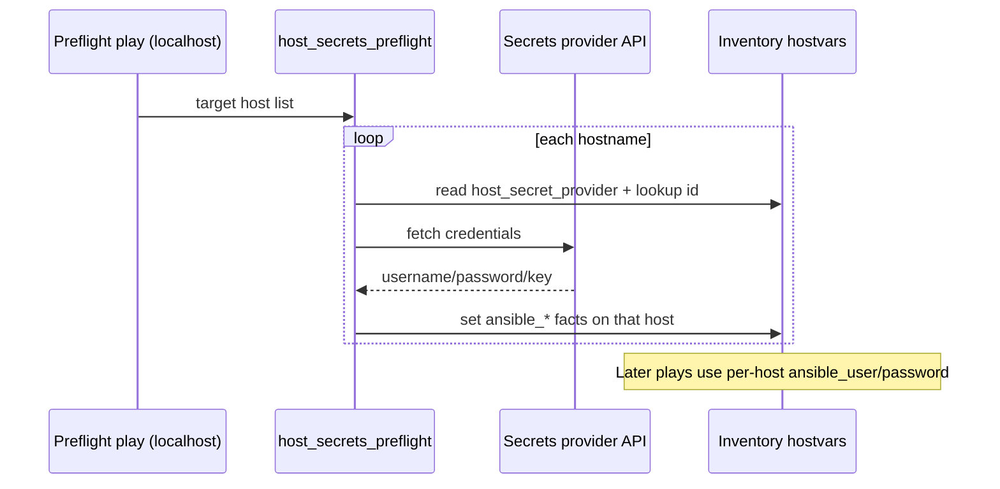

# demo-per-host-secrets — Per-host credentials from external secrets providers

Ansible and AAP normally expect one set of connection variables (`ansible_user`, `ansible_password`, SSH key, etc.) for every host in a play. That breaks down when you must target many servers but **cannot use a shared account** across them — and you also want to avoid connecting one host at a time or storing every password in an Ansible Vault file.

This demo adds a **preflight role** that:

1. Loops each inventory hostname in a target group
2. Reads `host_secret_provider` from that host (or a default)
3. Fetches that host's username/password (and optional SSH key) from **CyberArk**, **HashiCorp Vault**, or **Bitwarden**
4. Sets `ansible_user`, `ansible_password`, and related connection facts **on that host only**
5. Lets later plays connect normally across the full inventory



## Layout

| Path | Purpose |
|------|---------|
| [`playbook.yml`](playbook.yml) | Local CLI demo (`managed` inventory group) |
| [`playbook-aap.yml`](playbook-aap.yml) | AAP job template entry (`all` inventory hosts) |
| [`roles/host_secrets_preflight/`](roles/host_secrets_preflight/) | Modular preflight role |
| [`roles/host_secrets_preflight/tasks/providers/`](roles/host_secrets_preflight/tasks/providers/) | Provider backends (`mock`, `hashicorp_vault`, `cyberark`, `bitwarden`) |
| [`vars/secrets.example.yml`](vars/secrets.example.yml) | Provider connection settings (copy → `vars/secrets.yml`) |
| [`inventories/hosts.example.yml`](inventories/hosts.example.yml) | Sample mixed-host inventory |

## Quick start (mock provider — no external APIs)

```bash
cd demo-per-host-secrets
cp vars/secrets.example.yml vars/secrets.yml
cp inventories/hosts.example.yml inventories/hosts.yml
ansible-playbook playbook.yml -e @vars/secrets.yml
```

The bundled inventory uses `ansible_connection: local` so you can see the flow without real SSH targets. Switch hosts to real SSH targets and set each host's `host_secret_provider` when you connect to live secrets backends.

## Per-host inventory variables

| Variable | Purpose |
|----------|---------|
| `host_secret_provider` | Provider for this host: `mock`, `hashicorp_vault`, `cyberark`, `bitwarden` |
| `host_secret_id` | Lookup key (defaults to `inventory_hostname`) |
| `host_secret_path_prefix` | Shared prefix before lookup id (e.g. `prod/linux/`) |
| `host_secret_path_suffix` | Shared suffix after lookup id (e.g. `-ssh`) |
| `host_secret_username_field` | Payload key for username (default `username`) |
| `host_secret_password_field` | Payload key for password (default `password`) |
| `host_secret_ssh_private_key_field` | Payload key for PEM material (default `ssh_private_key`) |

Provider-specific overrides (examples):

- CyberArk: `host_secret_cyberark_folder`, `host_secret_cyberark_query_format`
- Mock (offline testing): `host_secret_mock_username`, `host_secret_mock_password`

## Global / playbook variables

Provider authentication and defaults live in [`roles/host_secrets_preflight/defaults/main.yml`](roles/host_secrets_preflight/defaults/main.yml). Override them in `vars/secrets.yml`, group_vars, or an AAP survey.

Key knobs:

- `host_secrets_preflight_default_provider` — used when a host omits `host_secret_provider`
- `host_secrets_preflight_path_prefix` / `host_secrets_preflight_path_suffix` — shared decoration for every host
- `host_secrets_preflight_set_ansible_become_password` — also copy password to `ansible_become_password`
- `host_secrets_preflight_key_cache_dir` — where fetched PEM keys are written (mode `0600`)

## Using the role in your own playbooks

```yaml
- name: Preflight — per-host credentials
  hosts: localhost
  gather_facts: false
  tasks:
    - ansible.builtin.include_role:
        name: host_secrets_preflight
      vars:
        host_secrets_preflight_target_hosts: "{{ groups['managed'] }}"

- name: Your real work
  hosts: managed
  tasks:
    - ansible.builtin.ping:
```

On AAP with an inventory that does not include `localhost`, run the preflight play against `all` with `run_once: true` and `delegate_to: localhost` (see [`playbook-aap.yml`](playbook-aap.yml)).

## Provider notes

### HashiCorp Vault (KV v2)

Expects a secret at:

`{mount}/data/{prefix}{host_secret_id}{suffix}`

with fields `username`, `password`, and optional `ssh_private_key` (field names are configurable).

Set `host_secrets_preflight_vault_url`, `host_secrets_preflight_vault_token`, and optionally `host_secrets_preflight_vault_mount` / `host_secrets_preflight_vault_namespace`.

### CyberArk PAS (Central Credential Provider)

Uses the AIM Web Service:

`GET /AIMWebService/api/Accounts?AppID=...&Safe=...&Folder=...&Object=<lookup_id>`

Maps `UserName` and `Content` to Ansible connection variables. Override the query parameter name with `host_secret_cyberark_query_format` when your safe uses `UserName` instead of `Object`.

### Bitwarden

Authenticates with API key (`client_credentials`) and selects a **Login** cipher (`type: 1`) whose **name** equals the computed lookup id.

- **Username / password** — from `login.username` and `login.password`
- **SSH private key** (optional) — from a **hidden** custom field (type `1`), default name `ssh_private_key`. Do not use Notes.

| Variable | Default | Purpose |
|----------|---------|---------|
| `host_secrets_preflight_bitwarden_ssh_private_key_field` | `ssh_private_key` | Hidden custom field name on the Login item |
| `host_secrets_preflight_bitwarden_ssh_private_key_require_hidden` | `true` | Only accept hidden (type 1) fields for PEM material |

Per-host override: `host_secret_bitwarden_ssh_private_key_field`. Set `host_secret_require_ssh_private_key: true` to fail when the hidden field is missing.

### Mock

Deterministic offline credentials for CI and learning:

- username → lookup id (override with `host_secret_mock_username`)
- password → `demo-<lookup_id>-password`

## Adding another provider

1. Create `roles/host_secrets_preflight/tasks/providers/<name>.yml`
2. Set `_host_secrets_preflight_payload` (or set `_host_secrets_preflight_username` / `_host_secrets_preflight_password` directly)
3. Include `map_payload.yml` if you use a key/value payload
4. Add `<name>` to `host_secrets_preflight_supported_providers` in `defaults/main.yml`
5. Document required auth variables in `vars/secrets.example.yml`

## Security practices

- Sensitive tasks use `no_log: true` (toggle with `host_secrets_preflight_no_log`)
- SSH keys are written to `host_secrets_preflight_key_cache_dir` with mode `0600` (gitignored)
- Prefer short-lived Vault tokens / CyberArk AppID access / Bitwarden machine accounts
- Do not commit `vars/secrets.yml`

## AAP

Job template: **Demo | Per-Host Secrets** (select the **Per-Host Secrets** demo on **Playground | Apply CaC**).

Uses the **Playground Fake Hosts Inventory** with the mock provider by default. Set per-host `host_secret_provider` in inventory host_vars when you attach a real inventory and provider configuration.
