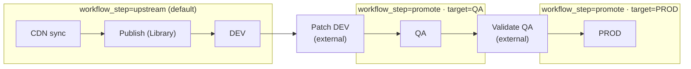
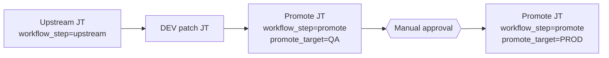

# demo-satellite-sync-and-promote — Sync repos, wait, promote through DEV → QA → PROD

Demonstrates automating **Red Hat Satellite** with the [`redhat.satellite`](https://console.redhat.com/ansible/automation-hub/repo/published/redhat/satellite) collection: **sync** products or repositories, **wait** for sync tasks, **publish** a Content View, **promote** through lifecycle environments using extra vars (AAP Survey–friendly).

## Lifecycle workflow



| Phase | Extra vars | What runs |
|-------|------------|-----------|
| Upstream | `satellite_workflow_step=upstream` (default) | Sync, publish, promote Library → **DEV** |
| After DEV patch | `workflow_step=promote` `promote_target=QA` | Single hop DEV → **QA** |
| After QA sign-off | `workflow_step=promote` `promote_target=PROD` | Single hop QA → **PROD** |

No tag juggling — one playbook, two variables.

## Key variables

| Variable | Default | Description |
|----------|---------|-------------|
| `satellite_workflow_step` | `upstream` | `upstream` or `promote` |
| `satellite_promote_target` | `DEV` (via `satellite_lifecycle_dev`) | Lifecycle LE to promote **into**; must match Satellite names |
| `satellite_lifecycle_dev` / `_qa` / `_prod` | `DEV` / `QA` / `PROD` | Configure once; use same strings as `promote_target` |
| `satellite_promote_to_dev` | `true` | Upstream only: when false, sync + publish only |

On **upstream** runs, the play forces `satellite_promote_target` to DEV regardless of survey default.

## How to run (CLI)

```bash
# 1) Sync, publish, promote to DEV
ansible-playbook playbook.yml

# 2) After DEV patching — promote to QA
ansible-playbook playbook.yml \
  -e satellite_workflow_step=promote \
  -e satellite_promote_target=QA

# 3) After QA sign-off — promote to PROD
ansible-playbook playbook.yml \
  -e satellite_workflow_step=promote \
  -e satellite_promote_target=PROD
```

## Ansible Automation Platform (one playbook, survey-driven)

Use [`playbook-aap.yml`](playbook-aap.yml) for a **single job template** (or two templates with different survey defaults on the same playbook).

### Suggested survey

| Question | Variable | Type | Choices / default |
|----------|----------|------|-------------------|
| Workflow | `satellite_workflow_step` | Multiple choice | `upstream` (default), `promote` |
| Promote into environment | `satellite_promote_target` | Multiple choice | `DEV`, `QA`, `PROD` — default `DEV`; only matters when workflow is `promote` |
| Content view | `satellite_content_view` | Text | required |
| Product to sync | `satellite_product` | Text | required when upstream |
| Repository (optional) | `satellite_repository` | Text | optional |

**Upstream job** (workflow = upstream): survey can hide or ignore `satellite_promote_target` — the play sets target to DEV. Extra vars on the template: `satellite_workflow_step=upstream`.

**Promote job** (workflow = promote): set survey `satellite_workflow_step=promote` and user picks `QA` or `PROD`. No sync/publish tasks run.

### Workflow template chain (optional)



Same promote job template twice with different extra vars, or one template with survey `satellite_promote_target`.

## Configure variables

```bash
cp group_vars/all/satellite.example.yml group_vars/all/satellite.yml
```

## Layout

```text
demo-satellite-sync-and-promote/
├── README.md
├── playbook.yml
├── playbook-aap.yml
├── group_vars/all/satellite.example.yml
└── roles/
    ├── satellite_sync/
    ├── satellite_publish_promote/
    └── satellite_promote_lifecycle/
```

## Prerequisites on Satellite

1. Manifest, enabled repos, Content View with those repos.
2. Lifecycle path **Library → DEV → QA → PROD** (names match vars).
3. Activation keys per environment.

## Install the collection

```bash
ansible-galaxy collection install -r requirements.yml
```

## References

- [Satellite Ansible Collection — example playbooks](https://docs.redhat.com/en/documentation/red_hat_satellite/6.18/html/using_the_satellite_ansible_collection/example-playbooks-based-on-modules-from-satellite-ansible-collection)
- `ansible-doc redhat.satellite.content_view_version`
