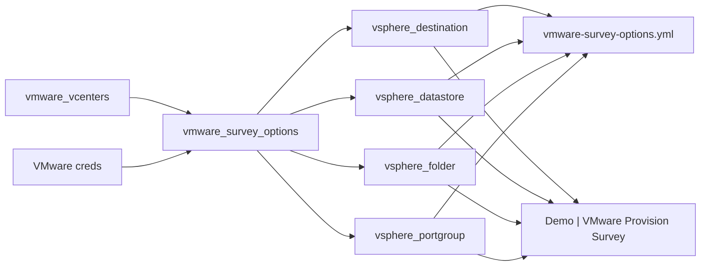

# demo-vmware-survey-options — Gather vSphere values and refresh an AAP survey

Connects to a **list of vCenter servers**, gathers inventory-scoped values, and
stores sorted unique lists as Ansible facts (and optional YAML/JSON artifacts).
Optionally **creates/updates** an AAP Job Template survey so operators can pick
those values as single-select choices.



## Survey option formats

| Variable | AAP question label | Format | Example |
|----------|--------------------|--------|---------|
| `vsphere_destination` | Destination | `hostname / datacenter / cluster` | `vcsa01.lab.example / East / compute-a` |
| `vsphere_datastore` | Datastore | `[name]` — StoragePods and/or standalone datastores | `[vsan-primary]` |
| `vsphere_folder` | Folder | `hostname/datacenter/folder` (nested with `/`) | `vcsa01.lab.example/East/Workloads` |
| `vsphere_portgroup` | Portgroup | Portgroup name (uplink DVS PGs skipped) | `app-vlan-100` |

Lists are **sorted** and **deduplicated** across all vCenters.

## Key variables

| Variable | Default | Description |
|----------|---------|-------------|
| `vmware_vcenters` | `[]` | List of hostnames, or dicts with `hostname` + optional credential overrides |
| `vmware_vcenters_text` | `""` | AAP survey textarea (newline/comma separated); used when the list is empty |
| `vmware_username` / `vmware_password` | — | Shared credentials (AAP credential injectors) |
| `vmware_validate_certs` | `true` | TLS verify |
| `include_nested_vm_folders` | `true` | Include nested VM-and-Templates folders |
| `vsphere_datastore_mode` | `both` | `pods` (SDRS only), `datastores`, or `both` (pods + standalone DS) |
| `update_aap_survey` | `false` (CLI) / `true` (AAP JT) | Create/update the target job template survey |
| `aap_survey_job_template` | `Demo \| VMware Provision Survey` | JT that receives the four survey questions |
| `aap_organization` / `aap_survey_project` / `aap_survey_inventory` | Playground names | Used when creating/updating the JT |
| `report_dir` | `playbook_dir` (CLI) | Where to write artifacts |
| `export_vars_file` / `export_json_file` | `true` | Write YAML / JSON artifacts |

## Prerequisites

- Python **pyvmomi** on the controller / execution environment (`pip install pyvmomi`)
- Read-only (or better) vCenter permissions to list datacenters, clusters, datastore clusters, VM folders, and networks
- **`ansible.controller`** collection when `update_aap_survey` is true (bundled on AAP EEs)
- AAP project must ship `library/vmware_survey_options.py` (this demo directory)

## How to run (CLI)

```bash
cd demo-vmware-survey-options
cp vars/vmware_survey.example.yml vars/vmware_survey.yml
# edit hostnames + credentials
ansible-playbook playbook.yml -e @vars/vmware_survey.yml
```

To also push choices into AAP, set `update_aap_survey: true` and provide AAP auth
(`aap_hostname` + `aap_token`, or `CONTROLLER_*` env / AAP credential).

Artifacts (gitignored on live runs):

- `vmware-survey-options.yml` — ready for `-e @…` or survey seed tooling
- `vmware-survey-options.json` — same data plus per-vCenter counts

Checked-in samples (sanitized):
[`vmware-survey-options.example.yml`](vmware-survey-options.example.yml) and
[`vmware-survey-options.example.json`](vmware-survey-options.example.json).

### Example YAML output

```yaml
vsphere_destination:
  - "vcsa01.lab.example / East / compute-a"
  - "vcsa01.lab.example / East / compute-b"
  - "vcsa02.lab.example / West / compute-a"
  - "vcsa02.lab.example / West / compute-b"

vsphere_datastore:
  - "[nfs-shared]"
  - "[vsan-primary]"
  - "[iso-library]"

vsphere_folder:
  - "vcsa01.lab.example/East/Workloads"
  - "vcsa01.lab.example/East/Workloads/web"
  - "vcsa02.lab.example/West/Lab"
  - "vcsa02.lab.example/West/Lab/jumpboxes"

vsphere_portgroup:
  - "app-vlan-100"
  - "db-vlan-200"
  - "mgmt"
```

## Ansible Automation Platform

Two job templates (created by **Playground | Apply CaC**):

| Job template | Role |
|--------------|------|
| **Demo \| VMware Survey Options** | Gather from vCenters; optionally refresh the provision survey |
| **Demo \| VMware Provision Survey** | Operator-facing survey with the four single-select questions |

Attach to the gather JT:

- **Playground VMware vSphere** → `vmware_username` / `vmware_password`
- **AAP Credential** → `CONTROLLER_*` for `ansible.controller.job_template`

### Gather JT survey

| Question | Variable | Type | Notes |
|----------|----------|------|-------|
| vCenter hostnames | `vmware_vcenters_text` | Textarea | One hostname per line |
| Validate TLS certificates | `vmware_validate_certs` | Multiple choice | `true` / `false` |
| Include nested VM folders | `include_nested_vm_folders` | Multiple choice | `true` / `false` |
| Datastore cluster mode | `vsphere_datastore_mode` | Multiple choice | `both` / `pods` / `datastores` |
| Update AAP provision survey | `update_aap_survey` | Multiple choice | Default `true` |
| Target job template | `aap_survey_job_template` | Text | Default `Demo \| VMware Provision Survey` |
| Report directory | `report_dir` | Text | Default `/tmp/vmware-survey-options` |

### Provision JT survey (refreshed by gather)

| Question | Variable | Type |
|----------|----------|------|
| Destination | `vsphere_destination` | Multiple choice |
| Datastore | `vsphere_datastore` | Multiple choice |
| Folder | `vsphere_folder` | Multiple choice |
| Portgroup | `vsphere_portgroup` | Multiple choice |

Workflow: launch **Survey Options** → then launch **Provision Survey** and pick from live choices.

## Layout

```text
demo-vmware-survey-options/
├── README.md
├── playbook.yml                 # gather + optional AAP survey update
├── playbook-aap.yml             # JT wrapper (import_playbook)
├── playbook-provision-survey.yml  # target JT — echoes selected survey vars
├── ansible.cfg
├── collections/requirements.yml # ansible.controller
├── vmware-survey-options.example.yml
├── vmware-survey-options.example.json
├── library/
│   └── vmware_survey_options.py
├── templates/
│   └── survey_options.yml.j2
└── vars/
    └── vmware_survey.example.yml
```

## References

- [pyVmomi](https://github.com/vmware/pyvmomi)
- [ansible.controller.job_template](https://docs.ansible.com/ansible/latest/collections/ansible/controller/job_template_module.html)
- [community.vmware](https://docs.ansible.com/projects/ansible/latest/collections/community/vmware/) (optional if you extend with collection modules)
