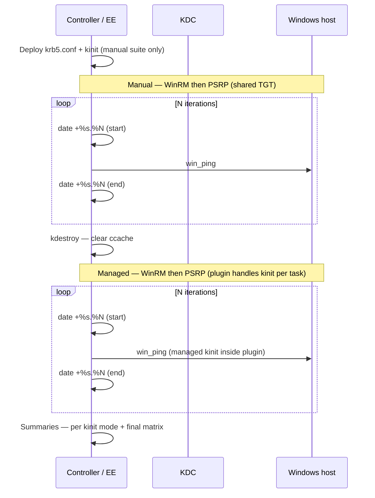

# demo-winrm-vs-psrp — WinRM vs PSRP timing with Kerberos

Runs the **same benchmark task** against one Windows host under **two kinit strategies** and **two connection plugins**:

| Suite | Kinit behavior | WinRM | PSRP |
|-------|----------------|-------|------|
| **Manual** | One `kinit` before benchmarks; plugins reuse default ccache | `ansible_winrm_kinit_mode: manual` | Uses shared TGT |
| **Managed** | Connection plugins kinits per task (`ansible_winrm_kinit_mode: managed`) | WinRM plugin | PSRP Kerberos auth via plugin |

Per-iteration timings are recorded on the controller so you can compare cold vs warm connection reuse and the cost of per-task authentication.

> **Do not run these playbooks with `ansible-playbook` on your Linux workstation.** They template `/etc/krb5.conf` and run `kinit` on the machine executing the tasks — without an EE, that overwrites **your host's** Kerberos configuration. Use **`ansible-navigator`** or **AAP** only.

## What this shows



| Metric | Meaning |
|--------|---------|
| **Iteration 1 (cold)** | First task in the play — includes connection and authentication setup |
| **Iterations 2+ (warm)** | Reuses Ansible's persistent connection for that play |
| **total_seconds** | Sum of all iteration times for that plugin |
| **warm_avg_seconds** | Average of iterations 2 through N |
| **delta_*** | PSRP minus WinRM; negative values mean PSRP was faster |

Both kinit suites target the **same inventory host** (`hosts: windows`). Manual suite runs first with a shared TGT from `kerberos_prep`; managed suite starts with `kdestroy` so no stale tickets remain. Explicit `kinit` runs **only** in manual mode via `kerberos_prep` — never inside the benchmark timer.

## Layout

| Path | Purpose |
|------|---------|
| [`playbook.yml`](playbook.yml) | Navigator entry point |
| [`playbook-aap.yml`](playbook-aap.yml) | AAP job template entry point |
| [`roles/kerberos_prep/`](roles/kerberos_prep/) | Deploy krb5.conf + kinit before benchmarks |
| [`roles/connection_benchmark/`](roles/connection_benchmark/) | Timed iterations, summaries, and report |
| [`roles/connection_benchmark/files/format_benchmark_report.py`](roles/connection_benchmark/files/format_benchmark_report.py) | Formats results → readable report |
| `connection-benchmark-report.txt` | Generated report (gitignored; written each run) |
| [`vars/benchmark.example.yml`](vars/benchmark.example.yml) | Local lab vars (copy → `vars/benchmark.yml`, gitignored) |
| [`inventories/group_vars/windows.yml`](inventories/group_vars/windows.yml) | Kerberos WinRM/PSRP connection defaults |
| [`inventories/hosts.example.yml`](inventories/hosts.example.yml) | Sample Windows inventory |
| [`execution-environment.yml`](execution-environment.yml) | EE definition (`ee-minimal-rhel9:2.16` + dig + ansible.windows) |
| [`ansible-navigator.yml`](ansible-navigator.yml) | Navigator defaults (`mode: stdout`, EE image, inventory, `ansible.cfg`) |
| [`ansible.cfg`](ansible.cfg) | Default inventory + `result_format = yaml` |

## Common setup

```bash
cd demo-winrm-vs-psrp
cp vars/benchmark.example.yml vars/benchmark.yml
cp inventories/hosts.example.yml inventories/hosts.yml
# edit vars/benchmark.yml (realm, domain, credentials, iterations)
# edit inventories/hosts.yml (Windows hostname)
```

`ansible_user` must be **UPN form** (`svc-ansible@EXAMPLE.COM`) for Kerberos. Set it in `vars/benchmark.yml` or per-host in `inventories/hosts.yml`.

Pass all lab-specific settings through **one vars file**:

```bash
ansible-navigator run playbook.yml -e @vars/benchmark.yml
```

### SPN troubleshooting

If connectivity fails with **"Server not found in Kerberos database"**, the `HTTP/<hostname>` SPN is missing or mismatched. Check on Windows with `setspn -L <computername>` and set `ansible_winrm_kerberos_hostname_override` on the host if needed (see [`inventories/hosts.example.yml`](inventories/hosts.example.yml)).

---

## How to run

Two supported paths — both execute inside an EE (container or AAP job pod), never directly on your workstation.

### 1. `ansible-navigator` (local EE)

**Build the EE** (once per dependency change):

```bash
cd demo-winrm-vs-psrp
podman login registry.redhat.io
ansible-builder build -f execution-environment.yml -t demo-winrm-vs-psrp-ee:latest
```

Base image: `registry.redhat.io/ansible-automation-platform-27/ee-minimal-rhel9:2.16`

**Run the benchmark**:

```bash
ansible-navigator run playbook.yml -e @vars/benchmark.yml

# Interactive TUI (override default stdout mode)
ansible-navigator run playbook.yml -e @vars/benchmark.yml --mode interactive
```

Navigator settings in [`ansible-navigator.yml`](ansible-navigator.yml):

| Setting | Value |
|---------|-------|
| Mode | `stdout` (terminal output; use `--mode interactive` for TUI) |
| EE image | `localhost/demo-winrm-vs-psrp-ee:latest` |
| Inventory | `inventories/hosts.yml` |
| Ansible config | `ansible.cfg` |
| Playbook + vars | `playbook.yml -e @vars/benchmark.yml` |

Optional overrides on the CLI:

```bash
ansible-navigator run playbook.yml -e @vars/benchmark.yml -e connection_benchmark_task=win_shell
ansible-navigator run playbook.yml -e @vars/benchmark.yml -e connection_benchmark_iterations=5
```

> **Note:** `vars/benchmark.yml` and `inventories/hosts.yml` are gitignored. Copy from the `.example` files.

---

### 2. Ansible Automation Platform

Use [`playbook-aap.yml`](playbook-aap.yml) on a job template. AAP supplies inventory, credentials, and survey answers as extra vars; the playbook does **not** use `vars_files` (no `benchmark.yml` required in the project).

#### Job template

| Field | Value |
|-------|-------|
| Playbook | `playbook-aap.yml` |
| Inventory | Your Windows inventory (group `windows`) |
| Execution environment | `demo-winrm-vs-psrp-ee:latest` |
| Credentials | Machine credential (UPN + password) |
| Privilege escalation | Off |

#### Survey (suggested)

| Question | Variable | Type | Default |
|----------|----------|------|---------|
| Kerberos realm | `kerberos_realm` | Text | `EXAMPLE.COM` |
| DNS domain | `kerberos_domain` | Text | `example.com` |
| Iterations | `connection_benchmark_iterations` | Integer | `3` |
| Benchmark task | `connection_benchmark_task` | Multiple choice | `win_ping` / `win_shell` |
| Deploy krb5.conf | `kerberos_deploy_krb5_conf` | Boolean | `true` |
| Run kinit before benchmark | `kerberos_run_kinit` | Boolean | `true` |

Machine credential username must be UPN form. WinRM/PSRP connection defaults live in `inventories/group_vars/windows.yml`.

---

## Expected output

During the run, each suite prints per-iteration debug lines and summary deltas in the playbook output.

At the end, a formatted report is written to **`connection-benchmark-report.txt`** in the demo directory (same pattern as `demo-kerberos-winrm`):

```bash
less demo-winrm-vs-psrp/connection-benchmark-report.txt
```

Example excerpt:

```text
==============================================================================
  WinRM vs PSRP Connection Benchmark
==============================================================================
  Host .......... winsrv-demo-01.lennysh.test
  Target ........ winsrv-demo-01.lennysh.test
  Auth .......... kerberos (LENNYSH.TEST)
  Port .......... 5985
  Generated ..... 2026-06-30 23:55:43 UTC

------------------------------------------------------------------------------
  MANUAL KINIT
------------------------------------------------------------------------------
  Per-iteration timings (seconds)
Iter            WinRM       PSRP        Delta (PSRP-WinRM)
--------------  ----------  ----------  ------------------
1 (cold)             5.239       5.680              +0.441
2 (warm)             5.932       4.222              -1.710
3 (warm)             5.876       4.649              -1.227

  Summary
Metric          WinRM       PSRP        Delta       Faster
Total               17.047      14.550      -2.497      PSRP
...

------------------------------------------------------------------------------
  FINAL MATRIX — total seconds
------------------------------------------------------------------------------
Kinit mode      WinRM       PSRP        Faster
Manual              17.047      14.550      PSRP
Managed             22.800      21.900      PSRP
```

To also `cat` the report into job output:

```yaml
connection_benchmark_report_display_mode: stdout
```

## Key variables

All lab-specific settings belong in **`vars/benchmark.yml`** (Navigator) or AAP survey / extra vars:

| Variable | Default | Description |
|----------|---------|-------------|
| `kerberos_realm` | `EXAMPLE.COM` | Realm for krb5.conf |
| `kerberos_domain` | `example.com` | DNS domain for `[domain_realm]` |
| `kerberos_kdc_hosts` | `[]` | Static KDC list; empty = `dns_lookup_kdc` |
| `kerberos_deploy_krb5_conf` | `true` | Template krb5.conf at runtime |
| `kerberos_run_kinit` | `true` | Run `kinit` before manual suite (not used in managed suite) |
| `connection_benchmark_iterations` | `3` | Timed task repetitions per plugin per kinit mode |
| `connection_benchmark_task` | `win_ping` | `win_ping` or `win_shell` |
| `ansible_winrm_kinit_mode` | `manual` | Default in `group_vars`; overridden to `managed` per task in managed suite |
| `connection_benchmark_report_path` | `{{ playbook_dir }}/connection-benchmark-report.txt` | Formatted TXT report output |
| `connection_benchmark_report_display_mode` | `file` | `file` = path only; `stdout` = also `cat` the report |

## Things to try

- Increase `connection_benchmark_iterations` to observe warm-connection pooling.
- Switch to `connection_benchmark_task: win_shell` for slightly heavier remote work.
- Compare cold (iteration 1) vs warm averages — Kerberos cold times include service ticket acquisition.
- Run against multiple Windows hosts — prep and benchmarks run per host; summary compares each.

## Role internals

[`roles/kerberos_prep/tasks/main.yml`](roles/kerberos_prep/tasks/main.yml) templates `krb5.conf` and runs `kinit` with `delegate_to: localhost` / `run_once: true`.

[`roles/connection_benchmark/tasks/write_report.yml`](roles/connection_benchmark/tasks/write_report.yml) runs [`format_benchmark_report.py`](roles/connection_benchmark/files/format_benchmark_report.py) after the final summary to produce `connection-benchmark-report.txt`.

Benchmark iterations use **variable-named task files** (no `when` skips inside the timed loop):

```yaml
include_tasks: measure_iteration_{{ connection_benchmark_kinit_mode }}_{{ connection_benchmark_plugin }}_{{ connection_benchmark_task }}.yml
```

The playbook calls the role via `tasks_from` (`measure.yml`, `summary.yml`, `summary_all.yml`) instead of branching in `main.yml`.
