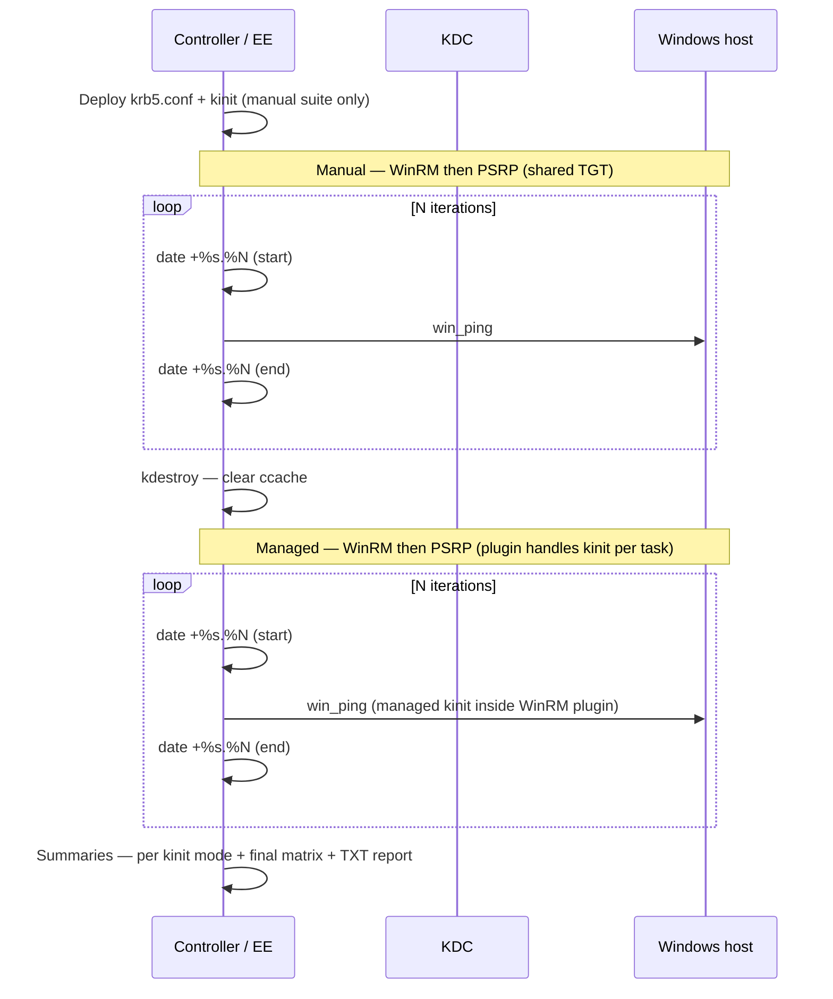

# demo-winrm-vs-psrp — WinRM vs PSRP timing with Kerberos

Runs the **same benchmark task** against one Windows host under **two kinit strategies** and **two connection plugins**:

| Suite | Kinit behavior | WinRM | PSRP |
|-------|----------------|-------|------|
| **Manual** | One `kinit` before benchmarks; plugins reuse default ccache | `ansible_winrm_kinit_mode: manual` (explicit) | Shared TGT via GSSAPI; proved with wrong password on timed tasks — see [Manual kinit: WinRM vs PSRP](#manual-kinit-winrm-vs-psrp-how-it-works-and-how-we-prove-it) |
| **Managed** | WinRM plugin kinits per task (`ansible_winrm_kinit_mode: managed`) | WinRM plugin | PSRP Kerberos auth in-process (GSSAPI) |

Per-iteration timings are recorded on the controller so you can compare cold vs warm connection reuse and the cost of per-task authentication.

> **Do not run these playbooks with `ansible-playbook` on your Linux workstation.** They template `/etc/krb5.conf` and run `kinit` on the machine executing the tasks — without an EE, that overwrites **your host's** Kerberos configuration. Use **`ansible-navigator`** or **AAP** only.

## What this shows



| Metric | Meaning |
|--------|---------|
| **Iteration 1 (cold)** | First task in the play — includes connection and authentication setup |
| **Iterations 2+ (warm)** | Reuses Ansible's persistent connection for that play |
| **total_seconds** | Sum of all iteration times for that plugin |
| **warm_avg_seconds** | Average of iterations 2 through N |
| **delta_*** | PSRP minus WinRM; negative values mean PSRP was faster |

Both kinit suites target the **same inventory host** (`hosts: windows`). Manual suite runs first with a shared TGT from `kerberos_prep`; managed suite starts with `kdestroy` so no stale tickets remain. Explicit `kinit` runs **only** in manual mode via `kerberos_prep` — never inside the benchmark timer.

### Playbook flow (`playbook.yml`)

| # | Play | Purpose |
|---|------|---------|
| 1 | Kerberos prep | Template `krb5.conf`, run `kinit` (manual mode gate) |
| 2–3 | WinRM / PSRP manual benchmarks | Timed iterations with shared TGT |
| 4 | Manual summary | Side-by-side WinRM vs PSRP |
| 5 | `kdestroy` | Clear ccache before managed suite |
| 6–7 | WinRM / PSRP managed benchmarks | WinRM tasks override `ansible_winrm_kinit_mode: managed` |
| 8 | Managed summary | Side-by-side WinRM vs PSRP |
| 9 | Final matrix + report | `connection-benchmark-report.txt` |

## Layout

| Path | Purpose |
|------|---------|
| [`playbook.yml`](playbook.yml) | Navigator entry point |
| [`playbook-aap.yml`](playbook-aap.yml) | AAP job template entry point |
| [`roles/kerberos_prep/`](roles/kerberos_prep/) | Deploy krb5.conf, `kinit`, and `kdestroy` |
| [`roles/connection_benchmark/`](roles/connection_benchmark/) | Timed iterations, summaries, and report |
| [`roles/connection_benchmark/files/format_benchmark_report.py`](roles/connection_benchmark/files/format_benchmark_report.py) | Formats results → readable report |
| [`roles/connection_benchmark/tasks/measure_iteration_*`](roles/connection_benchmark/tasks/) | One file per kinit mode × plugin × task (no `when` skips in timed loop) |
| `connection-benchmark-report.txt` | Generated report (gitignored; written each run) |
| [`vars/benchmark.example.yml`](vars/benchmark.example.yml) | Local lab vars (copy → `vars/benchmark.yml`, gitignored) |
| [`inventories/group_vars/windows.yml`](inventories/group_vars/windows.yml) | Kerberos WinRM/PSRP connection defaults |
| [`inventories/hosts.example.yml`](inventories/hosts.example.yml) | Sample Windows inventory |
| [`execution-environment.yml`](execution-environment.yml) | EE definition (`ee-minimal-rhel9:2.16` + dig + ansible.windows) |
| [`_build/files/krb5.conf.stub`](_build/files/krb5.conf.stub) | Stub krb5.conf baked into the EE image |
| [`ansible-navigator.yml`](ansible-navigator.yml) | Navigator defaults (mode, EE image, inventory, cmdline) |
| [`ansible.cfg`](ansible.cfg) | Default inventory + `result_format = yaml` |
| [`collections/requirements.yml`](collections/requirements.yml) | `ansible.windows` for the EE build |

## Common setup

```bash
cd demo-winrm-vs-psrp
cp vars/benchmark.example.yml vars/benchmark.yml
cp inventories/hosts.example.yml inventories/hosts.yml
# edit vars/benchmark.yml (realm, domain, credentials, iterations)
# edit inventories/hosts.yml (Windows hostname)
```

`ansible_user` must be **UPN form** (`svc-ansible@EXAMPLE.COM`) for Kerberos. Set it in `vars/benchmark.yml` or per-host in `inventories/hosts.yml`.

Pass all lab-specific settings through **one vars file**:

```bash
ansible-navigator run
```

[`ansible-navigator.yml`](ansible-navigator.yml) sets `ansible.cmdline` to `playbook.yml -e @vars/benchmark.yml`. You can still pass overrides on the CLI, but **positional args replace the settings-file cmdline** — prefer `-e` flags for one-off changes.

### SPN troubleshooting

If connectivity fails with **"Server not found in Kerberos database"**, the `HTTP/<hostname>` SPN is missing or mismatched. Check on Windows with `setspn -L <computername>` and set `ansible_winrm_kerberos_hostname_override` on the host if needed (see [`inventories/hosts.example.yml`](inventories/hosts.example.yml)).

### `ansible_winrm_kinit_mode` in group_vars

[`inventories/group_vars/windows.yml`](inventories/group_vars/windows.yml) sets `ansible_winrm_kinit_mode: manual` as the **inventory baseline** for the Windows group:

- **`kerberos_prep`** runs `kinit` only when mode is `manual`.
- **Manual benchmark** WinRM tasks also set `ansible_winrm_kinit_mode: "{{ connection_benchmark_kinit_mode }}"` explicitly.
- **Managed benchmark** WinRM tasks override to `managed` per timed task; inventory stays `manual`.
- **PSRP** ignores `ansible_winrm_kinit_mode` entirely (no `ansible_psrp_kinit_mode` exists).

Do not remove the group var — WinRM's plugin default is `managed`, which would break the manual suite's shared-ccache model.

> **Do not set `ansible_connection` at the play level.** Connection vars live in `inventories/group_vars/windows.yml` so `delegate_to: localhost` timing tasks stay on the local connection.

### Manual kinit: WinRM vs PSRP (how it works and how we prove it)

Both plugins can use the TGT that `kerberos_prep` puts in the **default credential cache**, but they expose that behavior very differently. The manual suite is only a fair comparison when you understand — and, for PSRP, verify — that each plugin is actually reusing that ticket.

#### Side-by-side

| | Manual WinRM | Manual PSRP |
|---|--------------|-------------|
| **Control knob** | `ansible_winrm_kinit_mode: manual` on the timed task | No equivalent; `ansible_psrp_auth: kerberos` only |
| **How the TGT is obtained** | `kerberos_prep` runs `kinit` once; WinRM is told **not** to kinit again | Same shared TGT from `kerberos_prep`; PSRP must pick it up via GSSAPI |
| **Per-task credential acquisition** | WinRM skips its managed kinit path | pypsrp can still acquire creds in-process (GSSAPI APIs, not a `kinit` subprocess) if `ansible_password` is present |
| **What `-vvvvv` shows** | `ESTABLISH WINRM CONNECTION` → `WINRM CONNECT: transport=kerberos` — **no** `calling kinit with pexpect` | `ESTABLISH PSRP CONNECTION` → `PSRP OPEN RUNSPACE: auth=kerberos` — **no** `kinit` line |
| **Managed suite contrast** | `calling kinit with pexpect` / `creating Kerberos CC at /tmp/...` on every iteration | Same `auth=kerberos` lines as manual; succeeds after `kdestroy` only because pypsrp obtains creds again (typically using `ansible_password`) |

WinRM **manual** is enforced by configuration: the plugin respects `ansible_winrm_kinit_mode: manual` and uses whatever is already in the default ccache. WinRM **managed** shells out to `kinit` (visible in verbose logs).

PSRP has no `ansible_psrp_kinit_mode`. With `ansible_psrp_auth: kerberos`, pypsrp always negotiates Kerberos over the runspace — the log line `auth=kerberos` appears for **both** manual and managed runs. Logs alone cannot show whether PSRP reused the prep TGT or acquired fresh credentials with the inventory password.

#### How manual PSRP reuses the prep ticket

After `kerberos_prep`:

1. `kinit` stores a TGT in the EE's default ccache (`FILE:/tmp/krb5cc_*` or similar).
2. Manual PSRP opens a runspace with `auth=kerberos`.
3. GSSAPI uses the **existing TGT** to request a service ticket for the WinRM/WSMan SPN (`HTTP/host` or `host/host` depending on pypsrp settings).
4. No new AS-REQ (TGT request) is needed as long as the cache is valid and the password is not used for re-authentication.

That is the same *outcome* as manual WinRM — shared TGT, service ticket per connection — but implemented inside pypsrp/GSSAPI instead of via WinRM's explicit kinit-mode switch.

#### How we prove it in this demo

Manual PSRP iteration tasks deliberately override the inventory password with a value that cannot authenticate:

```yaml
# measure_iteration_manual_psrp_win_ping.yml (and win_shell variant)
vars:
  ansible_connection: psrp
  ansible_password: "intentionally-wrong"
```

If PSRP were acquiring a **new** TGT on each task (managed-style behavior using the password), every manual PSRP iteration would **fail**. In practice they **succeed**, which shows:

- The TGT from `kerberos_prep` is present and usable.
- PSRP is reusing that cache for Kerberos — not re-kinitting with `ansible_password`.

Manual WinRM tasks do **not** need this trick: `ansible_winrm_kinit_mode: manual` already prevents per-task kinit, and verbose output omits `calling kinit with pexpect`.

**Suggested controls** (optional, for teaching):

| Test | Expected |
|------|----------|
| Manual PSRP + wrong password (as shipped) | **Success** — uses prep TGT |
| Manual PSRP + wrong password **without** prior `kerberos_prep` / after `kdestroy` | **Failure** — no TGT to reuse |
| Managed PSRP + wrong password after `kdestroy` | **Failure** — must acquire creds with password |
| Managed PSRP + correct password after `kdestroy` | **Success** — pypsrp obtains its own TGT via GSSAPI |

For managed PSRP, leave `ansible_password` at the real value from `vars/benchmark.yml` (see [`measure_iteration_managed_psrp_*.yml`](roles/connection_benchmark/tasks/)).

#### Takeaway for benchmarks

- **Manual WinRM vs manual PSRP** — both intended to run on the **same prep TGT**; PSRP requires the wrong-password check (or KDC logging) to confirm that in logs.
- **Managed WinRM vs managed PSRP** — both run **after `kdestroy`** with an empty default ccache; WinRM's per-task kinit is obvious in logs, PSRP's is silent but still depends on a valid `ansible_password` when no tickets exist.

---

## How to run

Two supported paths — both execute inside an EE (container or AAP job pod), never directly on your workstation.

### 1. `ansible-navigator` (local EE)

**Build the EE** (once per dependency change):

```bash
cd demo-winrm-vs-psrp
podman login registry.redhat.io
ansible-builder build -f execution-environment.yml -t demo-winrm-vs-psrp-ee:latest
```

Base image: `registry.redhat.io/ansible-automation-platform-27/ee-minimal-rhel9:2.16`

`ee-minimal-rhel9` uses **microdnf**; `execution-environment.yml` sets `options.package_manager_path: /usr/bin/microdnf` and copies `_build/files/krb5.conf.stub` via `additional_build_files`.

**Run the benchmark**:

```bash
ansible-navigator run

# Interactive TUI (override default stdout mode)
ansible-navigator run --mode interactive
```

Navigator settings in [`ansible-navigator.yml`](ansible-navigator.yml):

| Setting | Value |
|---------|-------|
| Mode | `stdout` (terminal output; use `--mode interactive` for TUI) |
| EE image | `localhost/demo-winrm-vs-psrp-ee:latest` |
| Inventory | `inventories/hosts.yml` |
| Ansible config | `ansible.cfg` |
| Playbook + vars | `-vvvvv playbook.yml -e @vars/benchmark.yml` (via `ansible.cmdline`; remove `-vvvvv` for quieter runs) |
| Playbook artifacts | `enable: true` — JSON saved as `playbook-artifact-{time_stamp}.json` |
| Navigator logging | `level: warning` (navigator log only; not ansible-playbook verbosity) |

Optional overrides (use `-e`; avoid replacing the whole cmdline with positional args):

```bash
ansible-navigator run -e connection_benchmark_task=win_shell
ansible-navigator run -e connection_benchmark_iterations=5
```

**Verbose output for debugging:** add `-vvvvv` to `ansible.cmdline` in a copy of the settings file, or run with `ANSIBLE_VERBOSITY=5`. There is no built-in “verbose in artifact only” split — use **`--mode interactive`**, redirect stdout (`> /dev/null 2>&1`), or inspect the saved playbook artifact / `ansible-navigator replay` afterward.

> **Note:** `vars/benchmark.yml` and `inventories/hosts.yml` are gitignored. Copy from the `.example` files.

---

### 2. Ansible Automation Platform

Use [`playbook-aap.yml`](playbook-aap.yml) on a job template. AAP supplies inventory, credentials, and survey answers as extra vars; the playbook does **not** use `vars_files` (no `benchmark.yml` required in the project).

#### Job template

| Field | Value |
|-------|-------|
| Playbook | `playbook-aap.yml` |
| Inventory | Your Windows inventory (group `windows`) |
| Execution environment | `demo-winrm-vs-psrp-ee:latest` |
| Credentials | Machine credential (UPN + password) |
| Privilege escalation | Off |

#### Survey (suggested)

| Question | Variable | Type | Default |
|----------|----------|------|---------|
| Kerberos realm | `kerberos_realm` | Text | `EXAMPLE.COM` |
| DNS domain | `kerberos_domain` | Text | `example.com` |
| Iterations | `connection_benchmark_iterations` | Integer | `3` |
| Benchmark task | `connection_benchmark_task` | Multiple choice | `win_ping` / `win_shell` |
| Deploy krb5.conf | `kerberos_deploy_krb5_conf` | Boolean | `true` |
| Run kinit before benchmark | `kerberos_run_kinit` | Boolean | `true` |

Machine credential username must be UPN form. WinRM/PSRP connection defaults live in `inventories/group_vars/windows.yml`.

---

## Expected output

During the run, each suite prints per-iteration debug lines and summary deltas in the playbook output.

At the end, a formatted report is written to **`connection-benchmark-report.txt`** in the demo directory (same pattern as `demo-kerberos-winrm`):

```bash
less demo-winrm-vs-psrp/connection-benchmark-report.txt
```

Example excerpt (5 iterations; your numbers will vary):

```text
==============================================================================
  WinRM vs PSRP Connection Benchmark
==============================================================================
  Host .......... winsrv-demo-01.example.com
  Auth .......... kerberos (EXAMPLE.COM)
  Port .......... 5985

------------------------------------------------------------------------------
  MANUAL KINIT
------------------------------------------------------------------------------
  Task .......... win_ping
  Iterations .... 5

  Per-iteration timings (seconds)
Iter            WinRM       PSRP        Delta (PSRP-WinRM)
--------------  ----------  ----------  ------------------
1 (cold)             5.686       4.466              -1.220
2 (warm)             6.000       4.988              -1.012
...

  Summary
Metric          WinRM       PSRP        Delta       Faster
Total               29.979      23.133      -6.845      PSRP
Cold (iter 1)        5.686       4.466      -1.220      PSRP
Warm avg             6.073       4.667      -1.406      PSRP

------------------------------------------------------------------------------
  FINAL MATRIX — total seconds
------------------------------------------------------------------------------
Kinit mode      WinRM       PSRP        Faster
Manual              29.979      23.133      PSRP
Managed             33.734      23.751      PSRP
```

To also `cat` the report into job output:

```yaml
connection_benchmark_report_display_mode: stdout
```

## Key variables

All lab-specific settings belong in **`vars/benchmark.yml`** (Navigator) or AAP survey / extra vars:

| Variable | Default | Description |
|----------|---------|-------------|
| `kerberos_realm` | `EXAMPLE.COM` | Realm for krb5.conf |
| `kerberos_domain` | `example.com` | DNS domain for `[domain_realm]` |
| `kerberos_kdc_hosts` | `[]` | Static KDC list; empty = `dns_lookup_kdc` |
| `kerberos_deploy_krb5_conf` | `true` | Template krb5.conf at runtime |
| `kerberos_run_kinit` | `true` | Run `kinit` before manual suite (gated by `ansible_winrm_kinit_mode: manual`) |
| `connection_benchmark_iterations` | `3` (role); `5` in `benchmark.example.yml` | Timed task repetitions per plugin per kinit mode |
| `connection_benchmark_task` | `win_ping` | `win_ping` or `win_shell` |
| `ansible_winrm_kinit_mode` | `manual` | In `group_vars/windows.yml`; managed WinRM tasks override per iteration |
| `connection_benchmark_report_path` | `{{ playbook_dir }}/connection-benchmark-report.txt` | Formatted TXT report output |
| `connection_benchmark_report_display_mode` | `file` | `file` = path only; `stdout` = also `cat` the report |

## Things to try

- Increase `connection_benchmark_iterations` to observe warm-connection pooling (very high counts can stress WinRM shell cleanup — watch for read timeouts).
- Switch to `connection_benchmark_task: win_shell` for slightly heavier remote work.
- Compare cold (iteration 1) vs warm averages — Kerberos cold times include service ticket acquisition.
- Run against multiple Windows hosts — prep and benchmarks run per host; summary compares each.
- Replay a saved artifact: `ansible-navigator replay playbook-artifact-....json`.
- Read [Manual kinit: WinRM vs PSRP](#manual-kinit-winrm-vs-psrp-how-it-works-and-how-we-prove-it) and try the optional control tests (managed PSRP with wrong password after `kdestroy` should fail).

## Role internals

[`roles/kerberos_prep/tasks/main.yml`](roles/kerberos_prep/tasks/main.yml) templates `krb5.conf` and runs `kinit` with `delegate_to: localhost` / `run_once: true`. [`roles/kerberos_prep/tasks/kdestroy.yml`](roles/kerberos_prep/tasks/kdestroy.yml) clears the ccache before the managed suite.

[`roles/connection_benchmark/tasks/write_report.yml`](roles/connection_benchmark/tasks/write_report.yml) runs [`format_benchmark_report.py`](roles/connection_benchmark/files/format_benchmark_report.py) after the final summary to produce `connection-benchmark-report.txt`.

Benchmark iterations use **variable-named task files** (no `when` skips inside the timed loop):

```yaml
include_tasks: measure_iteration_{{ connection_benchmark_kinit_mode }}_{{ connection_benchmark_plugin }}_{{ connection_benchmark_task }}.yml
```

The playbook calls the role via `tasks_from` (`measure.yml`, `summary.yml`, `summary_all.yml`) instead of branching in `main.yml`. `summary_all.yml` includes `summary_final.yml` then `write_report.yml`.
