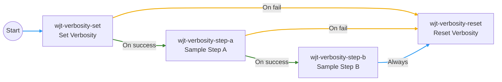

# Workflow Job Template verbosity override

Ansible Automation Platform workflow job templates (WJTs) cannot prompt for
**verbosity** on the child job templates they run. This demo shows a reusable
pattern:

1. **Survey** on the WJT for verbosity (labels match the Job Template verbosity
   dropdown: `0 (Normal)` … `5 (WinRM Debug)`).
2. **Set** job — updates the controller `verbosity` field on a configured list
   of job templates via the API (skipped when the survey value is the default).
3. **Sample steps** — child job templates that run at the updated verbosity.
4. **Reset** job — restores the default verbosity on those templates for future
   manual launches.

The Set and Reset job templates are **workflow-agnostic**: point them at any list
of job template names through `extra_vars`. Reuse the same Set/Reset templates
across multiple WJTs by changing only the target list on each workflow’s nodes
(or on the Set/Reset JT `extra_vars`).

## Architecture

Survey `wjt_verbosity_level` is on the **workflow** launch form (not a node in
the visualizer). Node **identifiers** match CaC / the Workflow Visualizer:



| Visualizer edge | CaC field | Meaning |
|-----------------|-----------|---------|
| Green **On success** | `success_nodes` | Run the next sample step |
| Amber **On fail** | `failure_nodes` | Skip remaining samples; run Reset |
| Blue **Always** | `always_nodes` | Run Reset whether Step B succeeds or fails |

Reset still skips API calls when survey verbosity is the default (`0`). Set uses
the same skip rule.

| Object | CaC name |
|--------|----------|
| Workflow | `Demo \| WJT Verbosity` |
| Set verbosity (API) | `Demo \| WJT Verbosity \| Set Verbosity` |
| Reset verbosity (API) | `Demo \| WJT Verbosity \| Reset Verbosity` |
| Sample child A | `Demo \| WJT Verbosity \| Sample Step A` |
| Sample child B | `Demo \| WJT Verbosity \| Sample Step B` |

## Launch in AAP

1. Re-run **Playground \| Apply CaC** with this demo selected (creates the four
   job templates and the workflow).
2. Open **Templates → Workflow Templates → Demo \| WJT Verbosity**.
3. Launch and pick **Verbosity** (0 = Normal … 5 = WinRM Debug).
4. Inspect the Set step output, then the sample steps (higher verbosity shows
   more `debug` tasks and module detail), then the Reset step.

**Default verbosity (0):** Set and Reset both log a skip message and do not call
the API; sample steps run at whatever verbosity is already on their templates.

**Sample step failures:** Reset is wired with `failure_nodes` (from Set and
Sample Step A) and `always_nodes` (from Sample Step B), so elevated verbosity
is restored when a middle step fails — but only when the survey level was
non-zero (Reset skips API calls at default verbosity, same as Set).

**CLI reset** (`wjt_verbosity_mode=reset` without `wjt_verbosity_level`) still
calls the API so you can force-restore templates outside a workflow.

## Configuring targets (reuse pattern)

On the Set and Reset job templates, `extra_vars` define which templates to touch:

```yaml
wjt_verbosity_target_job_templates:
  - "Demo | WJT Verbosity | Sample Step A"
  - "Demo | WJT Verbosity | Sample Step B"
wjt_verbosity_default: 0
```

To use Set/Reset in another WJT:

1. Add the same two job templates as the first and last nodes.
2. Enable **Prompt for extra variables** on those nodes *or* set
   `ask_variables_on_launch: true` on the Set/Reset JTs (already done in CaC).
3. Either keep the default `extra_vars` target list on the Set/Reset JTs, or
   override `wjt_verbosity_target_job_templates` on the workflow node / JT for
   that workflow only.
4. Add a WJT survey question `wjt_verbosity_level` (multiple choice, same labels
   as Job Template verbosity) — the Set step receives it when **Prompt for
   extra variables** propagates workflow survey answers.

Only list job templates that should run at the elevated verbosity — omit the Set
and Reset templates themselves.

## Survey (workflow)

| Variable | Type | Default | Description |
|----------|------|---------|-------------|
| `wjt_verbosity_level` | multiple choice | `0 (Normal)` | Controller JT verbosity applied to targets before sample steps |

Choices (searchable dropdown in AAP, same as JT verbosity):

| Value |
|-------|
| `0 (Normal)` |
| `1 (Verbose)` |
| `2 (More Verbose)` |
| `3 (Debug)` |
| `4 (Connection Debug)` |
| `5 (WinRM Debug)` |

The Set/Reset playbooks parse the leading integer from the survey answer.

## CLI (API helper only)

```bash
cd demo-wjt-verbosity
ansible-galaxy collection install -r collections/requirements.yml
cp vars/wjt_verbosity.example.yml vars/wjt_verbosity.yml
# edit targets / level / mode

export AAP_HOSTNAME=https://aap.example.com
export AAP_TOKEN=...

ansible-playbook playbook.yml -e @vars/wjt_verbosity.yml
```

## Files

| File | Purpose |
|------|---------|
| `playbook-aap-set-verbosity.yml` | WJT first node — API set |
| `playbook-aap-reset-verbosity.yml` | WJT last node — API reset |
| `playbook-aap-sample-step.yml` | Shared sample child playbook |
| `roles/wjt_verbosity_api/` | API logic (`ansible.controller.job_template`) |
| `playbook.yml` | CLI wrapper for set/reset testing |

## Notes

- Updates the **job template** `verbosity` field, not per-workflow-node prompts
  (WJTs do not expose node-level verbosity for arbitrary child JTs).
- Requires **AAP Credential** on Set/Reset job templates.
- Concurrent workflow runs that target the same job templates can race; scope
  targets per workflow or serialize runs if that matters in production.
